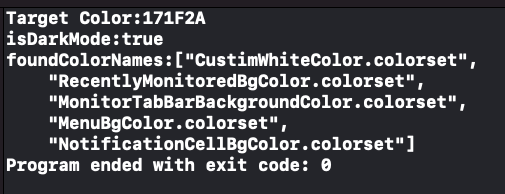
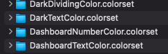
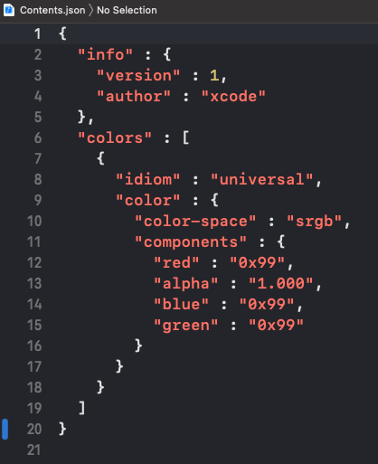

# ColorAssetsFinder 

- ColorAssetsFinder can help you find particular color assets easily by hex color code.

## Features
- Find particular color assets in Assets.xcassets by hex color code(ex: #FFFFFF).
- Find colors in dark mode or light mode.

## Screenshots


## What the difficulties that developers would face without using this project?
- Using color assets became necessary while developing dark mode.
    - Difficulty 1: The color assets are acturely folders. 
    - Difficulty 2: The color information is wirtten in a json file and separate to 4 parts: Red, Green, Blue and Alpha. You are unable to find it easily through hex color code(ex: #FFFFFF).

| Difficulty 1 | Difficulty 2 |
|:---:|:---:|
|  |  |

## Install
### Git
- Git clone this project.
### Download
- Download this project directly.

## Usage

### Basic
- Set `assetsFolder`.
```swift
let assetsFolder = "PATH_TO_PROJECT/Assets.xcassets"
```

- Set `targetColor`.
```swift
var targetColor = "#E4EAEF"
```

- Set `isDarkMode`.
```swift
let isDarkMode = true
```
